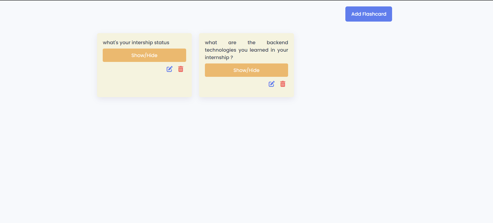
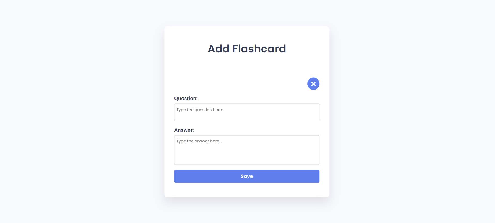

# Flashcard-Quiz-App
## Screenshots

## Overview

The Flashcard Quiz App is a web-based application designed to help users learn and review information using flashcards. Users can create, edit, and quiz themselves on different sets of flashcards. The app is built using HTML, CSS, and JavaScript, providing a clean and intuitive user interface.

## Features

- **Create Flashcards**: Easily create and save new flashcards with a question and answer.
- **Edit Flashcards**: Update existing flashcards with new information.
- **Quiz Mode**: Test your knowledge by quizzing yourself with the flashcards.
- **Responsive Design**: The app is fully responsive, ensuring a seamless experience on both desktop and mobile devices.

## Technologies Used

- **HTML**: For the structure and layout of the app.
- **CSS**: For styling the app and ensuring it looks good across different devices.
- **JavaScript**: For the app's functionality, including creating, editing, and quizzing with flashcards.
